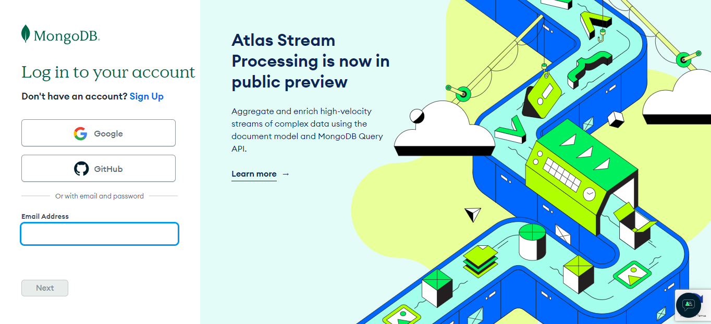
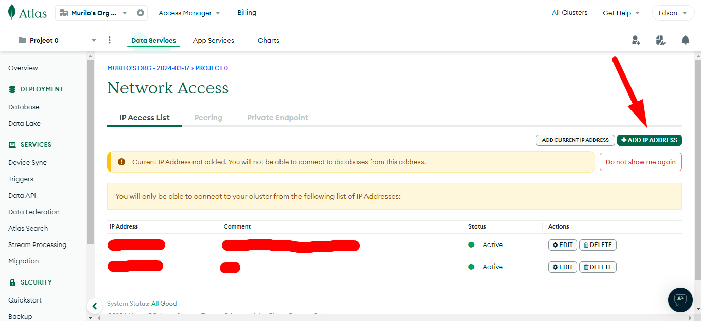
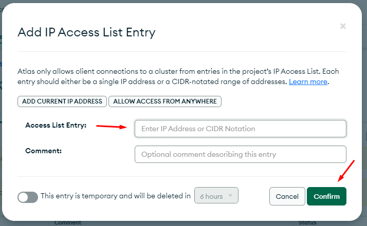

# Testes para Fluxo de Sessão e Criação de Usuários

Este README destina-se a fornecer uma visão geral dos testes realizados no fluxo de sessão e criação de usuários em nosso sistema. Os testes abrangem tanto testes unitários para controllers e serviços quanto testes de integração para garantir o funcionamento adequado dessas funcionalidades.

## Testes Unitários para o Fluxo de Sessão de Usuários

Os testes unitários para o fluxo de sessão de usuários foram criados para validar o comportamento esperado dos controllers e serviços envolvidos nesse processo. Eles incluem:

- **Controllers**: Verificação do comportamento dos controladores em resposta às solicitações de sessão de usuários, abrangendo casos de sucesso e falha.

- **Services**: Validação do funcionamento dos serviços responsáveis pela autenticação de usuários, geração de tokens de sessão e gerenciamento da sessão do usuário.

## Testes de Integração para o Fluxo de Criação de Usuários

Os testes de integração para o fluxo de criação de usuários garantem a interação correta entre controllers e serviços relacionados à criação de novos usuários. Eles incluem:

- **Controllers**: Verificação da configuração adequada dos controladores para lidar com solicitações de criação de usuários e resposta correta a essas solicitações.

- **Services**: Assegurar que os serviços de criação de usuários executem corretamente suas funcionalidades, incluindo validação de dados, criptografia de senhas e persistência adequada no banco de dados.

## Configurando Permissões de Acesso no MongoDB Cloud

Este guia fornece instruções sobre como configurar as permissões de acesso à rede no MongoDB Cloud para permitir que IPs específicos acessem o seu cluster MongoDB.

### Passo a Passo

1. **Acesse a Lista de Acesso à Rede no MongoDB Cloud**:
   - Acesse [este link](https://cloud.mongodb.com/v2/65f752167756c2746d46b92c#/security/network/accessList).

2. **Faça Login na sua Conta MongoDB**:
   - Se você ainda não estiver logado, será solicitado a fazer login na sua conta MongoDB. 

   

3. **Adicione o IP do Usuário à Lista de Acesso**:
   - Na página de Lista de Acesso à Rede, clique em "Add IP Address" ou similar.

    

   - Insira o endereço IP específico que você deseja permitir o acesso ao seu cluster MongoDB.
   - Salve as alterações.

   

### Observações
- Certifique-se de ter permissões adequadas para acessar e modificar as configurações de rede do seu projeto MongoDB.
- Repita este processo para adicionar múltiplos IPs, se necessário.

## Considerações Adicionais

- **Testes E2E**: A inclusão de testes end-to-end (E2E) é apreciada por garantir uma cobertura mais abrangente do sistema, verificando o fluxo completo de sessão e criação de usuários.

- **Utilização de Mocks**: Recomenda-se o uso de mocks para isolar as unidades de código em teste, garantindo que os testes sejam executados de forma independente e previsível, simulando o comportamento de dependências externas.

## Conclusão

Os testes unitários e de integração são cruciais para garantir a qualidade e a estabilidade do nosso sistema. Eles garantem que as funcionalidades do sistema estejam corretamente implementadas e continuem funcionando conforme o esperado, mesmo após alterações no código-fonte. Com uma sólida cobertura de testes, podemos proporcionar uma melhor experiência aos usuários finais e manter a confiabilidade do nosso aplicativo.

#### Contribuidores 🔻
